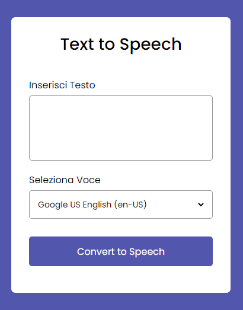
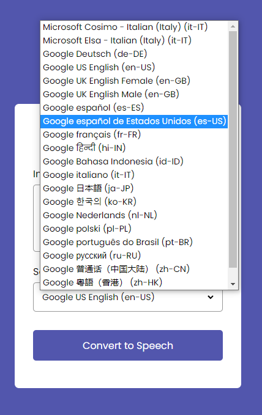
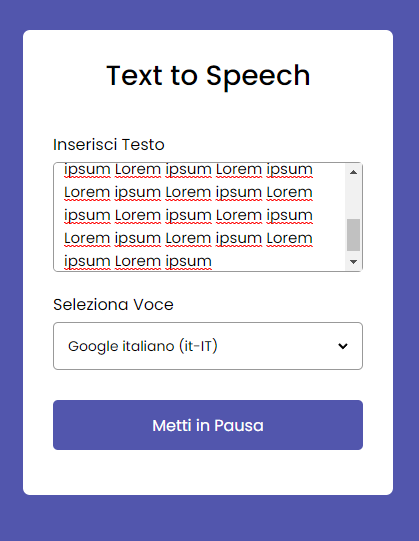
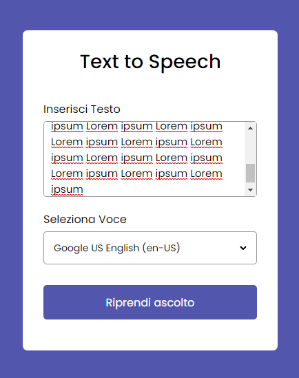

# Progetto Javascript TTS

Progetto relativamente semplice che permette all'utente di inserire un testo nell'apposita area di testo e convertirla in audio grazie a delle funzionalità interne del browser. Su chrome sono presenti molte più voci rispetto a Firefox. Per la ripetizione vocale non è stato necessario richiamare un'API, lo scopo dell'esercizio è stato quello di mostrarmi funzioni interne al linguaggio a me sconosciute.

- HTML (Markup)
- CSS (Markup)
- JAVASCRIPT

Condizione iniziale dell'app.

Voci disponibili della funzione `getVoices()` che, su chrome, permette un'ampia selezione disponibile.

Condizione di pausa in caso di un testo più lungo di 80 caratteri.

Possibilità di riprendere ascolto della ripetizione.

